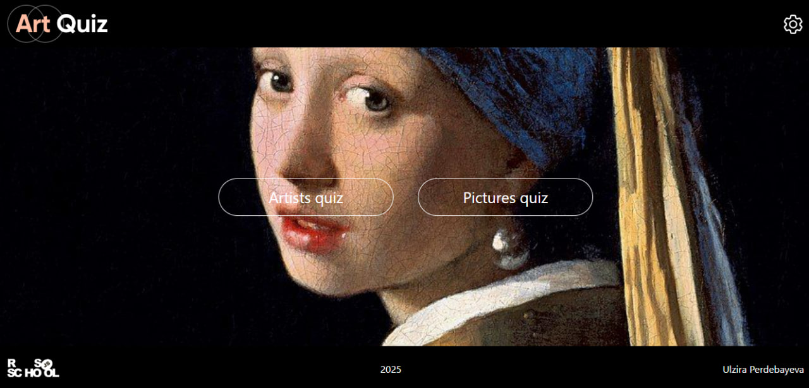
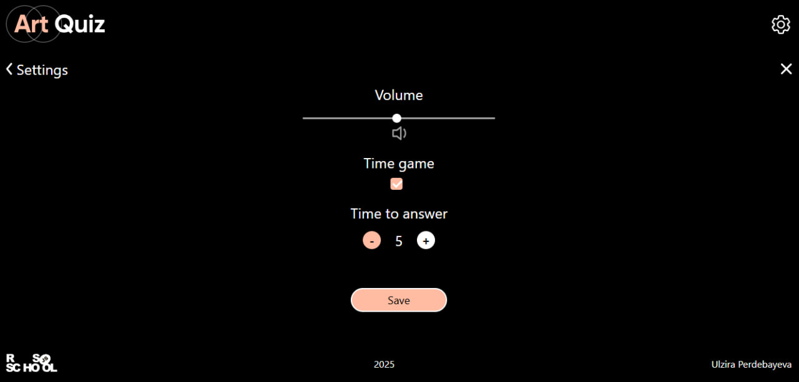
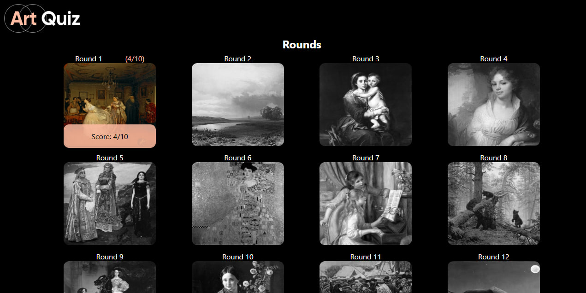
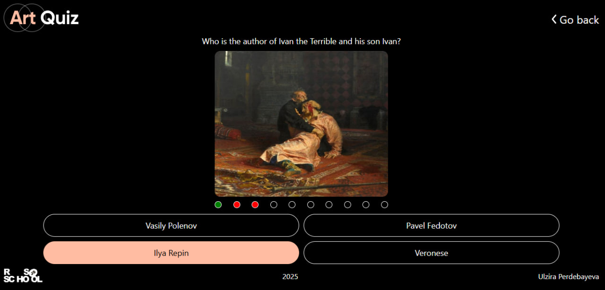
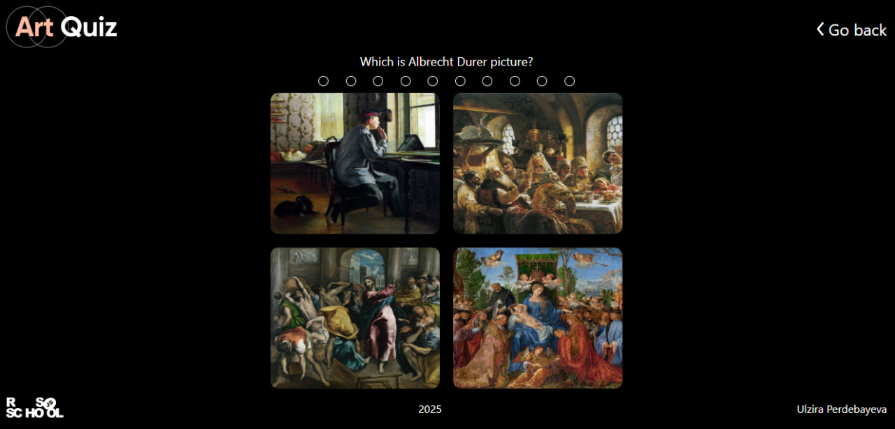
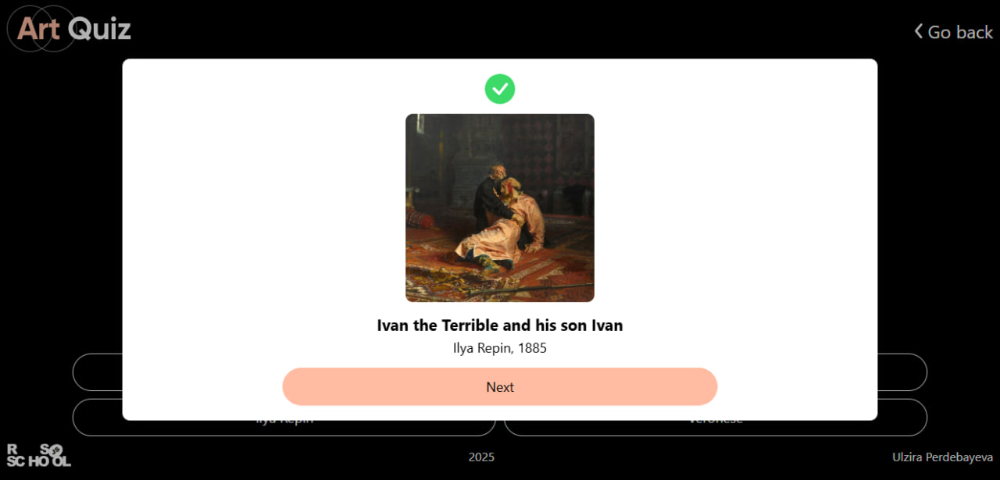
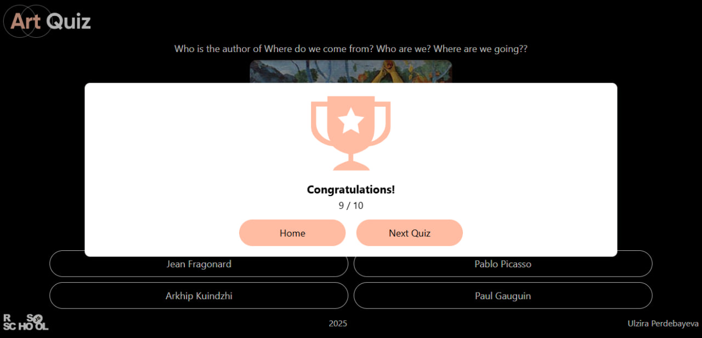
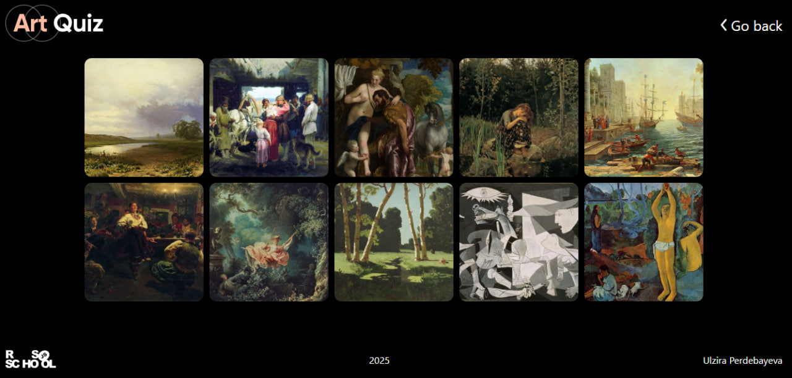
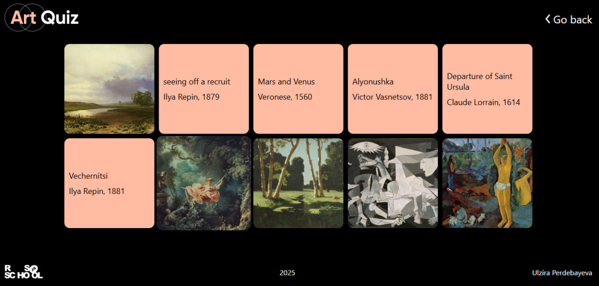

# SPA "Art Quiz" на чистом JavaScript
 ## Ссылка: https://ulzirok.github.io/art-quiz/
 ## ArtQuiz - это одностраничное приложение-викторина на знание шедевров живописи и их авторов.
 ### Ключевые навыки:
* OOP
* JavaScript Classes
* Modules in JavaScript
* CSS Animations
* Local Storage
* Генерирование HTML через JS
* Самостоятельное создание приложений
* Single Page Application

## Скриншоты проекта

